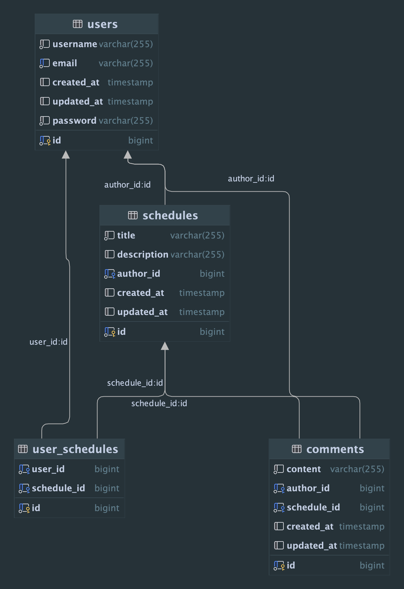

# Schedule Management Application (일정 관리 앱)

## Brief Description (소개)
“Schedule Management App” is a basic schedule planner that allows different registered users to read, modify and delete schedules they have created. They can also add, modify and delete comments on each other's posts.

'일정 관리 앱'은 서로 다른 등록된 사용자가 자신이 만든 일정을 읽고, 수정하고, 삭제할 수 있는 기본 일정 계획 도구입니다. 사용자는 서로의 게시물에 대해 댓글을 추가, 수정 및 삭제할 수 있는 간단한 앱입니다. 

## Project Environment 
- Project Type: Individual Project (개인 프로젝트)
- Spring Boot v3.3.4
- IDE: IntelliJ 2024.1.6
- Runtime version: 17.0.11+1-b1207.30 aarch64
- VM: OpenJDK 64-Bit Server VM by JetBrains s.r.o.

## Requirements (개발 조건)
- 모든 Table은 고유 식별자(ID)를 가집니다.
- 3 Layer Architecture 에 따라 각 Layer의 목적에 맞게 개발합니다.
- CRUD 필수 기능은 모두 Database 연결 및 JPA를 사용해서 개발합니다.
JDBC와 Spring Security는 사용하지 않습니다.
인증/인가 절차는 JWT를 활용하여 개발합니다.
JPA의 연관관계는 양방향으로 구현합니다.

## API Table (API 명세서)
### User (유저)
#### 1. User 생성 (Create a user):`/api/users`
- Request
  * Method: POST
  * URL: http://localhost:8080/api/users
  * Body: Select "raw" and set to JSON
   ` {
    "username": "ABCdef",
    "email": "abcdef@example.com",
    "password": "password123"
    }`
- Response
`  {
  "id": 1,
  "username": "ABCdef",
  "email": "abcdef@example.com"
  }`
- Status code: 201(CREATED)

#### 2. User login: `/api/users/login`
- Request
  * Method: POST
  * URL: http://localhost:8080/api/users/login
  * Body: Select "x-www-form-urlencoded"
    * Key: `username `→ Value: `ABCdef`
    * Key: `password` → Value: `password123`
- Response
 ` {
  "id": 1,
  "username": "ABCdef",
  "email": "abcdef@example.com"
  }`
- Status code: 200(OK)

#### 3. Get User by id: `api/users/{id}`
- Request
  * Method: GET
  * URL: http://localhost:8080/api/users/user_id
- Response
` {
  "id": 1,
  "username": "ABCdef",
  "email": "abcdef@example.com"
  }`
- Status code: 200(OK)

#### 4. Get all the users: `api/users`
- Request
    * Method: GET
    * URL: http://localhost:8080/api/users
- Response
` {
  "id": 1,
  "username": "ABCdef",
  "email": "abcdef@example.com"
  }`

` {
"id": 2,
"username": "ABCdef",
"email": "abcdef@example.com"
}`
- Status code: 200(OK)

#### 5. Update a user: `api/users/{id}`
- Request
  * Method: PUT
  * URL: http://localhost:8080/api/users/user_id
  * Body: Select "raw" and set to JSON
    `{
    "username": "updated_ABCdef",
    "email": "updated_abcdef@example.com",
    "password": "new_password123" 
    }`
- Response
`  {
  "id": 1,
  "username": "updated_ABCdef",
  "email": "updated_abcdef@example.com"
  }`
- Status code: 200(OK)

#### 6. Delete a user: `api/users/{id}`
- Request
  * Method: DELETE
  * URL: http://localhost:8080/api/users/user_id
- Response: Status `204 No Content`

### Schedule(일정)
#### 1. Create a schedule: `api/schedules`
- Request
  * Method: POST
  * URL: http://localhost:8080/api/schedules?authorId=author_id
  * Body: Select "raw" and set to JSON
   ` {
    "title": "ABCdef",
    "description": "AAAAAbbbbcccc DDDDeeefffff."
    }`
- Response
`  {
  "id": 1,
  "title": "ABCdef",
  "description": "AAAAAbbbbcccc DDDDeeefffff.",
  "authorName": "ABCdef",
  "createdAt": "2024-10-10T12:30:00",
  "updatedAt": "2024-10-10T12:30:00"
  }`
- Status code: 201(CREATED)

#### 2. Get a schedule by id: `/api/schedules/{id}`
- Request
  * Method: GET
  * URL: http://localhost:8080/api/schedules/schedule_id
- Response
  `{
  "id": 1,
  "title": "ABCdef",
  "description": "AAAAAbbbbcccc DDDDeeefffff.",
  "authorName": "ABCdef",
  "createdAt": "2024-10-10T12:30:00",
  "updatedAt": "2024-10-10T12:30:00"
  }`
- Status code: 200(OK)

#### 3. Get all the schedules: `/api/schedules`
- Request
  * Method: GET
  * URL: http://localhost:8080/api/schedules?page=0&size=10
  * Query Parameter: 
    * page: page 번호 (첫 번째 페이지는 기본값(default)이 0입니다)
    * size: page당 일정 개수 (기본값은 10개입니다)
- Response
 ` {
  "_embedded": {
  "scheduleResponseDtoList": [
  {
  "id": 1,
  "title": "ABCdef",
  "description": "AAAAAbbbbcccc DDDDeeefffff.",
  "authorName": "ABCdef",
  "createdAt": "2024-10-16T10:08:57",
  "updatedAt": "2024-10-16T10:08:57"
  },
  {
  "id": 2,
  "title": "ABCdef",
  "description": "AAAAAbbbbcccc DDDDeeefffff.",
  "authorName": "ABCdef",
  "createdAt": "2024-10-15T21:17:47",
  "updatedAt": "2024-10-15T21:17:47"
  }
  ]
  },
  "page": {
  "size": 10,
  "totalElements": 20,
  "totalPages": 2,
  "number": 0
  }
  }`
- Status code: 200(OK)

#### 4. Update a schedule: `api/schedule/{id}`
- Request
  * Method: PUT
  * URL: http://localhost:8080/api/schedules/schedule_id
  * Body: Select "raw" and set to JSON
   ` {
    "title": "Updated ABCdef",
    "description": "Updated AAAAAbbbbcccc DDDDeeefffff."
    }
`
- Response
 ` {
  "id": 1,
  "title": "Updated ABCdef",
  "description": "Updated AAAAAbbbbcccc DDDDeeefffff.",
  "authorName": "ABCdef",
  "createdAt": "2024-10-16T10:00:00",
  "updatedAt": "2024-10-17T10:00:00"
  }`
- Status code: 200(OK)

#### 5. Delete a schedule: `api/schedule/{id}`
- Request
  * Method: DELETE
  * URL: http://localhost:8080/api/schedules/schedule_id
- Response: Status `204 No Content`

### Comment(댓글)
#### 1. Create a comment: `/api/comments`
- Request
  * Method: POST
  * URL: http://localhost:8080/api/comments?userId=user_id&scheduleId=schedule_id
  * Body: Select "raw" and set to JSON
   ` {
    "content": "AAAAAbbbbcccc DDDDeeefffff."
    }`
- Response
 ` {
  "id": 1,
  "content": "AAAAAbbbbcccc DDDDeeefffff.",
  "authorName": "ABCdef",
  "createdAt": "2024-10-10T12:45:00",
  "updatedAt": "2024-10-10T12:45:00"
  }`
- Status code: 201(CREATED)

#### 2. Get comments by id: `/api/comments/{id}`
- Request
  * Method: GET
  * URL: http://localhost:8080/api/comments/comment_id
- Response
`  {
  "id": 1,
  "content": "AAAAAbbbbcccc DDDDeeefffff.",
  "authorName": "ABCdef",
  "createdAt": "2024-10-16T12:30:00",
  "updatedAt": "2024-10-16T12:30:00"
  }`
- Status code: 200(OK)

#### 3. Get comments by schedule id: `/api/comments/schedule/{scheduleid}`
- Request
  * Method: GET
  * URL: http://localhost:8080/api/comments/schedule/schedule_id
- Response
`  [
  {
  "id": 1,
  "content": "AAAAAbbbbcccc DDDDeeefffff.",
  "authorName": "ABCdef",
  "createdAt": "2024-10-16T12:30:00",
  "updatedAt": "2024-10-16T12:30:00"
  },
  {
  "id": 2,
  "content": "AAAAAbbbbcccc DDDDeeefffff.",
  "authorName": "ABCdef",
  "createdAt": "2024-10-16T12:45:00",
  "updatedAt": "2024-10-16T12:45:00"
  }
  ]`
- Status code: 200(OK)

#### 4. Update comment: `/api/comments/{id}`
- Request
  * Method: PUT
  * URL: http://localhost:8080/api/comments/comment_id
  * Body: Select "raw" and set to JSON
 `   {
    "content": "Updated AAAAAbbbbcccc DDDDeeefffff."
    }
`
- Response
`  {
  "id": 1,
  "content": "Updated AAAAAbbbbcccc DDDDeeefffff.",
  "authorName": "ABCdef",
  "createdAt": "2024-10-16T12:30:00",
  "updatedAt": "2024-10-17T10:00:00" // Reflects the update
  }`

#### 5. Delete comment: `/api/comments/{id}`
- Request
  * Method: DELETE
  * URL: http://localhost:8080/api/comments/comment_id
- Response: `204 No Content`

### User-Schedule
#### 1. Assign user to schedule:`/api/user-schedules`
- Request
  * Method: PUT
  * URL: http://localhost:8080/api/user-schedules?userId=user_id&scheduleId=schedule_id
- Response
`  {
  "userId": 1,
  "username": "ABCdef",
  "scheduleId": 1,
  "scheduleTitle": "ABCdef"
  }`
- Status code: 201(CREATED)

#### 2. Remove user from schedule: `/api/user-schedules`
- Request
  * Method: DELETE
  * URL: http://localhost:8080/api/user-schedules?userId=user_id&scheduleId=schedule_id
- Response: Status `204 No Content`

#### 3. Get users assigned to schedules: `/api/user-schedules//schedule/{scheduleId}`
- Request
  * Method: GET
  * URL: http://localhost:8080/api/user-schedules/schedule/schedule_id
- Response
`  [
  {
  "userId": 1,
  "username": "ABCdef",
  "scheduleId": 1,
  "scheduleTitle": "ABCdef"
  },
  {
  "userId": 2,
  "username": "ABCdef",
  "scheduleId": 1,
  "scheduleTitle": "ABCdef"
  }
  ]`
- Status code: 200(OK)

## ERD

## Parts to improve 
The whole codebase needs to be improved especially:
- Generate a JWT
- Login authentication 
Feel free to add review that can help to improve the code and create an excellent app.